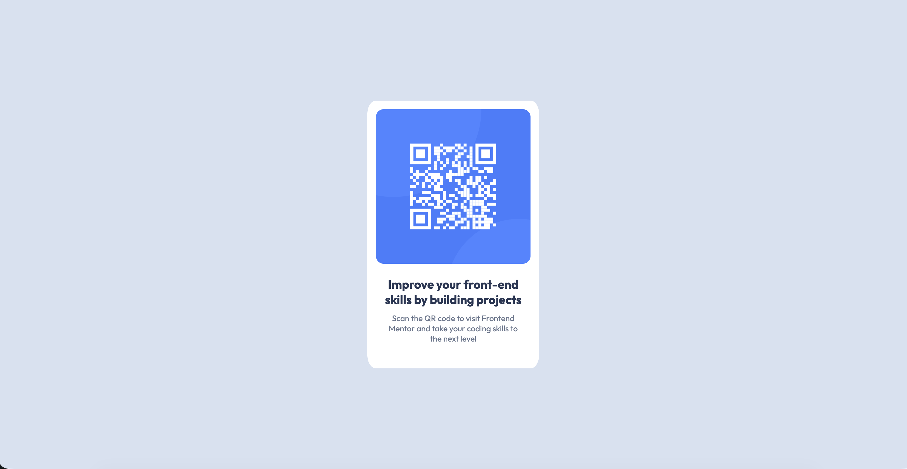

# Frontend Mentor - Solution du composant QR code

Voici une solution au [challenge QR code component sur Frontend Mentor](https://www.frontendmentor.io/challenges/qr-code-component-iux_sIO_H). Les challenges Frontend Mentor vous permettent d'améliorer vos compétences en programmation en réalisant des projets réalistes.

## Aperçu

### Capture d'écran

### Liens

- URL de la solution sur GitHub : https://github.com/isamu64/qr-code-component
- URL du site en ligne : https://isamu64.github.io/qr-code-component/
- URL du challenge : https://www.frontendmentor.io/challenges/qr-code-component-iux_sIO_H

## Mon processus

### Description du challenge

Créé un QR code (image fourni) avec du texte en dessous, le tout centré parfaitement au centre de la page.

### Technologies utilisées

- Balisage HTML5 sémantique
- Propriétés personnalisées CSS
- Flexbox

### Ce que j'ai appris

Ce challenge m'a permis de me remettre tout doucement au code après des années sans le pratiquer. J'ai eu quelques difficultés avec Flexbox car je n'arrivais pas à centrer correctement le tout, il m'a fallu l'aide de l'IA et de la documentation Flexbox pour comprendre ce que je faisais et y arriver.

### Développement continu

Je veux continuer à utilisé massivement HTML, CSS, Flexbox et bien d'autres choses comme Grid ou Javascript par la suite.
Apprendre Figma ainsi que l'UX/UI.

### Ressources utiles

- [Doc Flexbox](https://css-tricks.com/snippets/css/a-guide-to-flexbox/) — Cette ressource m'a aidé pour l'utilisation de flexbox. J'ai particulièrement apprécié cette méthode et je compte continuer à l'utiliser.
- [MDN](https://developer.mozilla.org/fr/) - Site indispensable pour comprendre HTML et CSS. Coupler avec l'IA pour encore plus éclaircir les notions qui peuvent être parfois difficile à comprendre juste en lisant ce site.

### Collaboration avec l'IA

J'ai utilisé Chat GPT pour m'aiguiller lorsque j'étais bloqué. Il me fournis des indices petit a petit dorénavant car au début il me donnais la solution trop rapidement et ce n'est pas comme ça que je veux apprendre. Donc j'ai mis en place une façon de répondre à mes interrogations avec une méthode indice par indice.

## Auteur

- Frontend Mentor - [@isamu64](https://www.frontendmentor.io/profile/isamu64)
